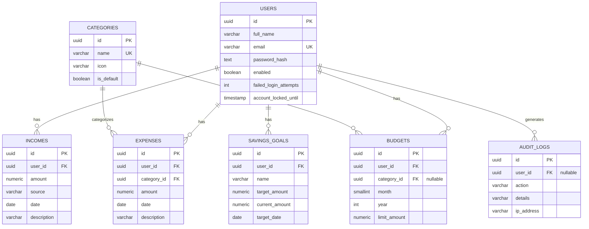

# Diagrams

Mermaid source for the ER diagram — render at https://mermaid.live or with
a Mermaid-enabled Markdown viewer.

## Still to produce
- Class diagram (Controller/Service/Repository/Entity relationships)
- Use case diagram (register, login, manage income/expense/budget/savings, generate report)
- Sequence diagram (login flow with JWT issuance + refresh)
- High-level architecture diagram (React ⟷ Spring Boot ⟷ PostgreSQL, with the security filter chain)

Ask for any of these and I'll generate them as Mermaid/SVG next.
